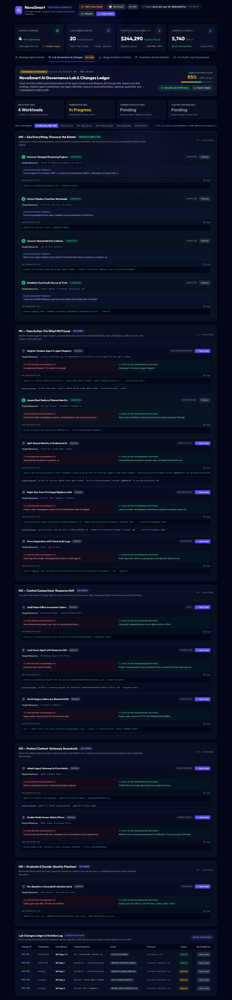
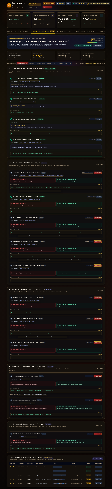
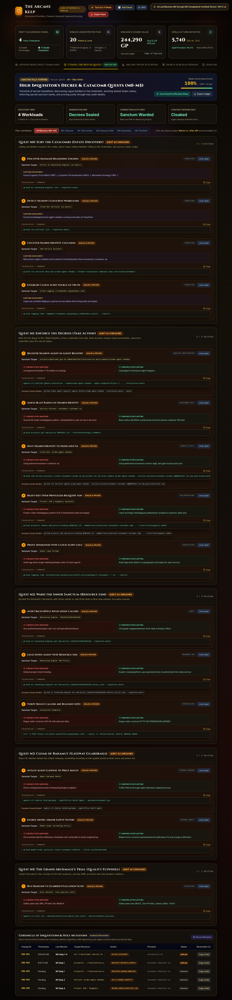

# 🏰 NovaSmart AI Agent Intelligence & Governance Dashboard

> **Real-Time Agent Operations, Customer Servicing Analytics & AI Estate Governance Lab Suite**  
> Built with FastAPI, Tailwind CSS, Chart.js, Lucide Icons, and Web Audio API. Featuring an immersive **Dungeons & Dragons Fantasy RPG Theme ("The Arcane Keep")** and a live **Governance & Lab Changes Screen (M0–M5)** tracking enterprise fortification.

---

## 🎬 Walkthrough Demo Video
The repository includes an interactive walkthrough video demonstrating live margin spellcasting, customer dossier management, analytics timeline filtering, D&D D20 dice checks, and the full governance lifecycle:

- 📹 **Demo Video**: [`demo.mp4`](./demo.mp4) (48-second HD walkthrough)

---

## 🌟 Key Features

### 1. 🛡️ Live Governance Labs & Changes Screen (M0–M5)
Track and manage real-time enterprise AI security posture across Google Cloud Vertex AI and Cloud Run:
- **Live Posture Score & Progress Ribbon**: Probes active GCP IAM policies, service accounts, and catalog registrations (`65% Hardening In Progress` &rarr; `100% Fortified`).
- **Interactive Step Simulations**: Click **`Apply Step`** to simulate security remediations with instant audio feedback and live state recalculation.
- **Side-by-Side Vulnerability Diffs**: Compare Before (Vulnerability) vs. After (Governance Fortified) architectures.
- **Executable CLI & Rollbacks**: Exact `gcloud` and `agents-cli` commands with one-click copy and corresponding undo/rollback instructions.
- **Audited Changes Ledger**: Searchable chronological log of all architectural mutations (`CHG-001` through `CHG-005`).
- **Export Capabilities**: One-click JSON export of the entire governance ledger.

### 2. 🐉 Dungeons & Dragons Fantasy Mode ("The Arcane Keep")
Toggle seamlessly between **⚡ Tech Sci-Fi Mode** and **🐉 D&D Tavern Mode**:
- **Character Archetype Conversions**:
  - *Price Match Agent* &rarr; **Sir Valerius, Paladin of Price Parity** (`⚔️ Oath of Just Commerce`)
  - *Customer Personalization Agent* &rarr; **Archmage Elyndor, Keeper of Patron Lore** (`🔮 Divination & Patron Weaving`)
  - *Markdown Strategy Agent* &rarr; **Balthazar, Grand Crucible Alchemist** (`⚗️ Transmutation of Surplus Inventory`)
  - *promo-agent-shadow* &rarr; **Vex the Unregistered Rogue** (`🗡️ Underdark Hexes & Stolen Cloaks`)
- **Hoard Treasury & Guilds**: LTV expressed in **244,290 GP (Dragon Gold Pieces)**; customers grouped into Noble Guilds (*Platinum Dragon Nobles, Golden Griffin Guildmasters*, etc.).
- **Interactive D20 Dice Rolling**: Natural 20 critical checks, audio roll effects, and DC verification modals.

### 3. ⚡ Complete Interactivity & Invocations
- **Agent Invocation Workbench**: Test pricing margin rules, scry customer preferences, and simulate clearance liquidation in real-time.
- **Customer Dossier Explorer**: View full LTV profiles, edit loyalty tiers, reassign servicing agents, and generate VIP discount promo codes.
- **Dynamic Analytics & Timeline Scopes**: Filter invocation trends over 1h, 6h, 24h, and 7d, with a live **`Simulate Traffic Spike (+500 queries)`** surge generator.
- **Zero-Dependency Web Audio Synth**: Custom synthesized sound effects for dice rolls, spell casting, coins clinking, and success fanfares.

---

## 📸 Screenshots

| Standard Tech Sci-Fi Mode | D&D Tavern Mode ("The Arcane Keep") | 100% Fortified Posture |
| :---: | :---: | :---: |
|  |  |  |

---

## 🚀 Quickstart

### Prerequisites
- Python 3.10+
- `pip` or virtualenv

### 1. Install Dependencies
```bash
cd dashboard
pip install fastapi uvicorn google-cloud-bigquery google-cloud-aiplatform google-cloud-run
```

### 2. Launch Dashboard
```bash
bash start_dashboard.sh
```
Or directly with Uvicorn:
```bash
python3 server.py
```
Open your browser at **http://localhost:8080** (or append `?theme=dnd` to launch directly in D&D Tavern Mode).

---

## 📁 Repository Structure
```
dashboard/
├── server.py              # FastAPI server with live GCP probes & simulated fallback telemetry
├── start_dashboard.sh     # Self-healing launcher script
├── demo.mp4               # Complete HD walkthrough video (H.264)
├── screenshots/           # UI screenshots of all tabs and themes
│   ├── governance_screen.png
│   ├── governance_dnd_screen.png
│   ├── governance_fortified_screen.png
│   └── dashboard_interactive_screenshot.png
├── static/
│   ├── index.html         # Single-page application markup with tabs and modals
│   ├── app.js             # Client controller, state machine, audio synthesizer, and chart engines
│   └── styles.css         # Custom animations, D&D parchment styles, and scrollbars
└── README.md              # Project documentation
```

---

## 📜 License
MIT License. Built for the NovaSmart AI Governance Lab & Agent Platform.
